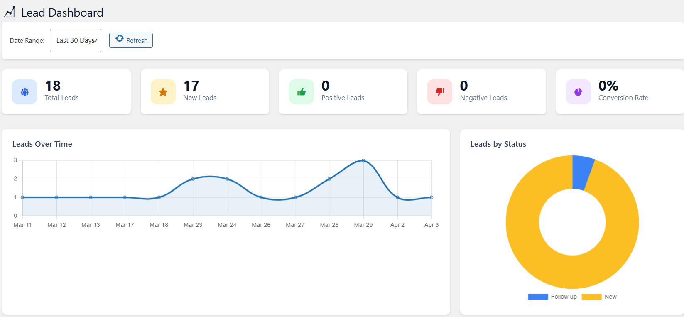

# Forminator Lead Dashboard

**A Lead Management addon for the Forminator WordPress plugin.**

Built by [Anup Kankale](https://www.linkedin.com/in/anupkankale/)

---

## What Does This Plugin Do?

When someone fills out a contact form on your website (built with Forminator), that submission becomes a **lead**. This plugin gives your sales team a proper dashboard inside WordPress to:

- See all leads in one place
- Mark leads as positive, negative, or converted
- Add feedback and notes on each lead
- Track how leads are coming in over time
- Export lead data to a spreadsheet (CSV)

Without this plugin, form submissions just pile up in Forminator with no way to track what happened to them.

---

## Who Is It For?

| Role | What They Can Do |
|---|---|
| **Administrator** | Full access — dashboard, leads, settings, user management |
| **Sales Admin** | Can view all leads, update statuses, and add feedback — nothing else |

Sales Admin users log in and land directly on the Lead Dashboard. They cannot access any other part of the WordPress admin.

---

## Key Features

### Dashboard Overview
- Stats cards showing Total Leads, New Leads, Positive Leads, Negative Leads, and Conversion Rate
- "Leads Over Time" line chart
- "Leads by Status" pie chart
- Top forms by lead count
- Recent leads table

### All Leads Page
- Paginated list of every lead
- Filter by form, status, date range, and assigned team member
- Search through lead data
- Click any lead to open a full detail panel

### Lead Detail Panel (Modal)
- See all form fields submitted
- Change lead status (New / Positive / Negative / Follow Up / Converted / Closed)
- Add sales feedback with a rating (positive / neutral / negative)
- View all previous feedback from your team
- Activity log showing every status change and action

### CSV Export
- Export leads filtered by form and status
- All form fields are included as columns

### Sales Admin User Management
- Admins can promote any WordPress user to Sales Admin directly from the Settings page
- Sales Admins can be removed just as easily
- Sales Admin users only see the Lead Dashboard — no clutter from the rest of WordPress

### Email Notifications *(Settings)*
- Optionally receive an email when a new lead arrives
- Configure which email address gets the notification

### Auto-Assignment *(Settings)*
- Automatically assign new leads to a specific team member

---

## How to Install

1. Make sure **Forminator** is installed and activated.
2. Upload this plugin folder to `/wp-content/plugins/`.
3. Go to **Plugins** in your WordPress admin and activate **Forminator Lead Dashboard**.
4. The plugin will create its database tables automatically.
5. A new **Lead Dashboard** menu will appear in your admin sidebar.

---

## How to Add a Sales Admin User

1. Go to **Lead Dashboard → Settings**.
2. Scroll down to **Sales Admin Users**.
3. Select any existing WordPress user from the dropdown.
4. Click **Add as Sales Admin**.

That user can now log in and access the Lead Dashboard. They won't see anything else.

---

## Lead Statuses Explained

| Status | Meaning |
|---|---|
| **New** | Just came in, not reviewed yet |
| **Positive** | Looks like a good lead |
| **Negative** | Not a good fit or not interested |
| **Follow Up** | Needs more contact before deciding |
| **Converted** | Became a customer |
| **Closed** | Done — no further action |

---

## Requirements

- WordPress 5.0 or higher
- PHP 7.4 or higher
- [Forminator](https://wpmudev.com/project/forminator-pro/) plugin (free version works)

---

## Plugin Structure

```
forminator-lead-dashboard/
├── forminator-lead-dashboard.php   # Main plugin file
├── includes/
│   ├── class-fld-database.php      # Database table setup
│   ├── class-fld-leads.php         # Lead data & stats queries
│   ├── class-fld-feedback.php      # Feedback CRUD
│   └── class-fld-roles.php         # User roles & capabilities
├── templates/
│   ├── dashboard.php               # Dashboard page
│   ├── leads.php                   # All Leads page
│   └── settings.php                # Settings page
└── assets/
    ├── css/admin-styles.css        # Plugin styles
    └── js/admin-scripts.js         # Plugin JavaScript
```

---

## License

GPL v2 or later — [https://www.gnu.org/licenses/gpl-2.0.html](https://www.gnu.org/licenses/gpl-2.0.html)
